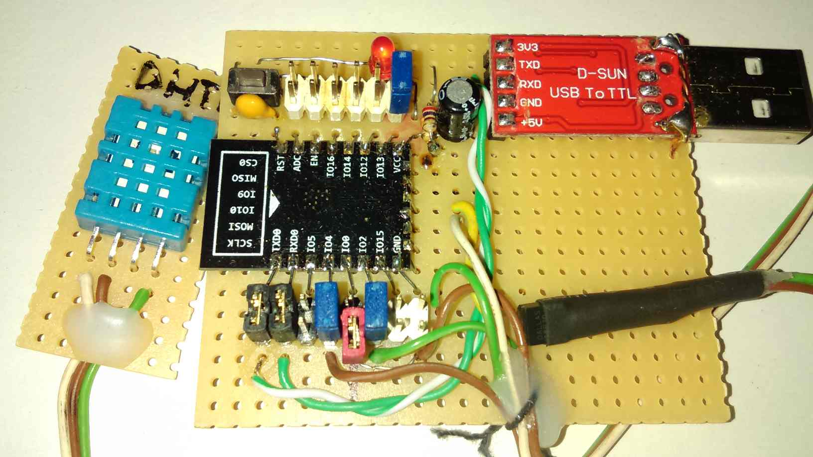

## Introduction

This is a personal memo for the ESP12E chip-related custom board setup shown below. It is a prototype for a 2-sensor hobby greenhouse system
so the code is maximally simplistic and the idea is to document software configuration instead.




The microcontroller is ESP12-E, and D-SUN's USB to TTL converter is there to flash and send the code via UART. 
The ESP12-E is rather "bare bones", and it costs around 6 euros here in Vilnius. At this point in time (2021) it is likely better 
to get a complete ready-made board with a microUSB, such as ESP32 DEVKIT DOIT which will also have more RAM. 

Initially I tested many facilities provided by ESP8266 (ESP12-E) and MicroPython hoping to employ it in a wireless mode. I used both HTTP and MQTT networking and interfacing this device with Android (via browser or MQTT DashBoard app). The HTTP communication was a headache, messy unreliable low level socket codes, some async, some not. At some point everything becomes wrapped in an exception, but even that does not prevent halting. The libs such as microwebsrv, picoweb did not run due to insufficient RAM in ESP12e, which turns out to be around 30K only.

The MQTT story was so much better, but that required registering on the chosen broker and wireless network problems were still there, not to mention troublesome reboots. So fundamentally that is a no go. Registering is not a problem per se, and CloudMQTT is free, but this adds a layer (one needs to keep the credentials and memorize the workflow). Initially (2019) I have also applied "MQTT Dashboard" as an Android client, and a few years later (2021) it is actually gone from the Android apps! Again, this is not a problem per se, but it shows the lack of stability in this domain.

## Prerequisites

- Install Python3, pip3, esptool and rshell:
```console
sudo apt-get install python3-pip
sudo pip3 install esptool
sudo pip3 install rshell
```
- Check the USB connection:
```console
ls /dev/ttyUSB*
dmesg | grep ttyUSB
```

## Flashing Firmware (Connected Jumper)

In this mode, GPIO0 is shorted to the ground.

- Download the latest [MicroPython firmware][MicroPython] and upload it to ESP12-E:
```console
esptool.py --port /dev/ttyUSB0 flash_id
esptool.py --port /dev/ttyUSB0 erase_flash
esptool.py --port /dev/ttyUSB0 --baud 460800 write_flash --flash_size=detect 0 esp8266-20210418-v1.15.bin
```

## Regular Workflow (Disconnected Jumper)

- Testing:
```console
rshell --buffer-size=30 -p /dev/ttyUSB0 -a
boards
ls /pyboard
cp test.py /pyboard
repl
import test
```
- Release:
```console
rshell --buffer-size=30 -p /dev/ttyUSB0 -a
cp main.py /pyboard
rm /pyboard/test.py
```

## Example

An example can be found in main.py and test.py. Both are identical except for the presence of printing to console in the latter. 
The code measures temperature values in C from two devices, one is DS18B20, the other DHT11 (which also provides humidity in percentages).
If the first sensor's value is bigger, the output on Pin 13 is activated.

Both sensors, especially DHT11, are very inertial. When I enclose the sensor DHT11 with my palm, it behaves erroneously, but slowly 
recovers upon the release of the palm:

```console
23 24 43 1
...
Ignoring DHT11 error, code checksum error.
23 15 175 0
23 30 94 1
23 30 89 1
23 30 73 1
23 15 175 0
23 30 94 1
23 30 89 1
23 30 73 1
23 30 65 1
23 30 62 1
23 30 61 1
23 30 54 1
23 30 50 1
23 30 46 1
23 28 43 1
23 29 42 1
23 29 41 1
...
```

## Conclusion 

**ESP8266-based devices are not really suitable for reliable IoT** and the myriad of toy demos available online are unfortunately misleading, education-only. Perhaps there is more hope with [ESP32][rdagger68] and this particular channel is an excellent work, but a reliable networking is still doubtful. 

On the other hand, ESP8266 is more capable than many lower ATmegas, and MicroPython allows a certain convergence/code uniformization and liberation from C and its shenanigans (fuse-bits, Makefile, pin management macros, USB connect-disconnect when flashing Digispark Attiny85, no proper arrays, tuples, maps, ridiculous delay function limits, fractured community...). ROM scanning seems to work for DS18B20, and the DHT11 driver library is readily available in the MicroPython eco system, one can find out in the example code how little effort is needed to connect these sensors.

## References

- [Getting Started]
- [rshell]
- [rdagger68]
- [MicroPython]

[Getting Started]: https://mitjafelicijan.com/esp8266-and-micropython-guide.html
[rshell]: https://github.com/dhylands/rshell
[rdagger68]: https://www.youtube.com/watch?v=w15-EQASP_Y&list=PLKGiH5V9SS1hUz5Jh_35oTFM4wPZYA4sT&index=1
[MicroPython]: https://micropython.org/download/esp8266/
